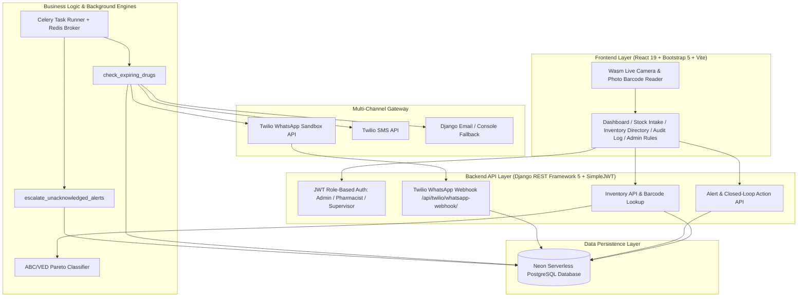
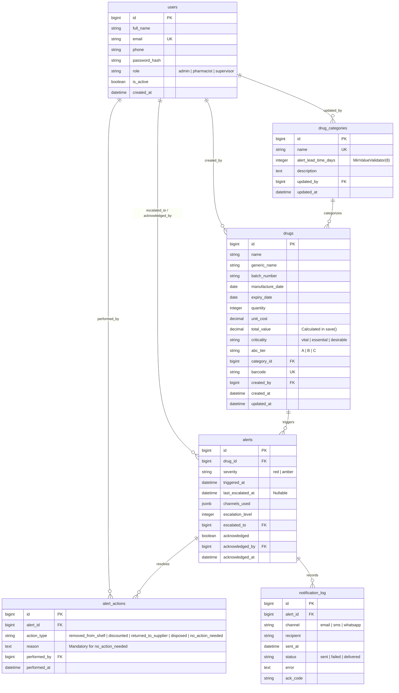

# PHARMACY PRODUCT EXPIRY ALERT MANAGEMENT SYSTEM
## Final Year Project Technical, Architectural & Defense Documentation

---

## 1. Executive Summary & Problem Statement

### 1.1 Project Overview
The **Pharmacy Product Expiry Alert Management System** is a full-stack software solution built to mitigate drug inventory waste, enforce financial accountability via **Pareto ABC/VED Analysis**, and ensure audit-compliant closed-loop responses for expiring pharmaceutical stock.

### 1.2 Problem Statement
Pharmaceutical waste due to undetected stock expiration represents a major operational and financial vulnerability in hospital and community pharmacies:
- **Financial Waste**: High-cost medications (e.g., oncology biologics, specialty injections, specialty insulin) expire on pharmacy shelves unnoticed because traditional inventory systems rely on manual stock checks.
- **Clinical & Patient Safety Hazards**: Dispensing expired pharmaceuticals introduces grave clinical risks, including reduced therapeutic efficacy, chemical degradation toxicity, and severe legal liabilities.
- **Absence of Accountability**: Stock removals often lack structured audit trails, masking stock shrinkage and inventory discrepancies.

### 1.3 Solution & Objectives
This project solves these issues by delivering:
1. **Category Lead-Time Rules**: Dynamic risk windows assigned by category (`Critical/High-Value`: 90 days, `Standard`: 60 days, `Fast-Moving`: 30 days) with an enforced mathematical floor of **8 days** (`MinValueValidator(8)`) to prevent Amber warning skipping.
2. **Pareto ABC/VED Classification Engine**: Automatically ranks stock by financial value (Tier A top 80%, Tier B next 15%, Tier C remaining 5%) integrated with clinical criticality tags (`Vital`, `Essential`, `Desirable`).
3. **Automated Background Scans & 48-Hour Escalation**: Celery background tasks perform daily expiry scans and escalate unacknowledged alerts to supervisors after 48 hours.
4. **Closed-Loop Audit Protocol**: Enforces documented resolution actions (`Removed from Shelf`, `Discounted`, `Returned to Supplier`, `Disposed`, `No Action Needed`) with mandatory written explanations for "No Action Needed".
5. **Multi-Channel Notification & Auto-ACK Webhook Gateway**: Broadcasts alerts across **Twilio WhatsApp Sandbox**, **Twilio SMS**, and **Email**. Includes a live webhook (`/api/twilio/whatsapp-webhook/`) handling WhatsApp auto-ACK replies (`ACK-xxxx`).
6. **Mobile Barcode & Image Scanner**: Decodes 1D linear barcodes (EAN-13 `6156000468334`, Code-128, Code-39, UPC) and 2D QR codes via live camera streaming or photo upload (`html5-qrcode`).

---

## 2. System Architecture & High-Level Design

The system implements a multi-tier, decoupled architecture:



---

## 3. Technology Stack Specification

| Component | Technology | Version | Key Responsibilities |
|---|---|---|---|
| **Backend Core** | Python / Django | Python 3.12, Django 5.x | REST API server, ORM modeling, business logic rules |
| **API Framework** | Django REST Framework | v3.14+ | Serializers, ViewSets, permission classes |
| **Authentication** | `djangorestframework-simplejwt` | v5.3+ | Stateless JWT access and refresh token management |
| **Database** | Neon PostgreSQL | PostgreSQL 16+ | Cloud serverless relational database |
| **Database Adapters** | `psycopg2-binary`, `dj-database-url` | v2.9+ / v3.0+ | Connection pooling & `DATABASE_URL` parsing |
| **Async Task Queue** | Celery + Redis | Celery 5.x, Redis 5.x | Background scheduled scans and escalation jobs |
| **Static Asset Serving** | Whitenoise | v6.8+ | Production static file collection for serverless hosts |
| **Frontend Core** | React / Vite | React 19, Vite 8.x | Dynamic Single Page Application (SPA) |
| **UI Design System** | Bootstrap 5, Bootstrap Icons | v5.3.8 / v1.13+ | Responsive layout, cards, modals, and tables |
| **Barcode Engine** | `html5-qrcode` | v2.3.8 | Wasm camera barcode decoder & file photo parser |
| **Mobile HTTPS Server** | `@vitejs/plugin-basic-ssl` | v1.x | Local SSL certificate server for mobile camera API access |
| **Notification Services** | Twilio REST API, Django Mail | Twilio v8.x | WhatsApp Sandbox dispatches, SMS, and Email |
| **Hosting Platform** | Vercel | Monorepo / Serverless | Web application deployment and API routing |

---

## 4. Database Schema & ER Diagram



---

## 5. Algorithms & Mathematical Formulations

### 5.1 Pareto ABC Financial Analysis Algorithm
The system calculates total inventory capital valuation for each drug:

$$\text{Total Valuation}_i = \text{Quantity}_i \times \text{Unit Cost}_i$$

1. Sort all active drugs in descending order of $\text{Total Valuation}_i$.
2. Compute cumulative percentage of total inventory capital:

$$\text{Cumulative Capital Share}_k = \frac{\sum_{i=1}^{k} \text{Total Valuation}_i}{\sum_{j=1}^{N} \text{Total Valuation}_j} \times 100\%$$

3. Assign ABC Tiers based on cumulative thresholds:
   - **Tier A (High Financial Value)**: Drugs contributing to the cumulative top **80%** of inventory value.
   - **Tier B (Medium Financial Value)**: Drugs contributing to the next **15%** of inventory value (80% to 95%).
   - **Tier C (Low Financial Value)**: Drugs contributing to the bottom **5%** of inventory value (95% to 100%).

---

### 5.2 Expiry Risk Assessment & Alert Rules
Given $\text{Days Remaining} = \text{Expiry Date} - \text{Current Date}$:
- **Red Alert (Urgent Risk)**: $\text{Days Remaining} \le 7$ (or expired).
- **Amber Alert (Early Lead-Time Risk)**: $7 < \text{Days Remaining} \le \text{Category Alert Lead Time Days}$.
- **Green (Safe Stock)**: Calculated dynamically in memory ($\text{Total Active Drugs} - \text{Open Alerts}$).

*Note: Since $\text{Category Alert Lead Time Days} \ge 8$, the range $7 < \text{Days Remaining} \le \text{Lead Time}$ is mathematically guaranteed non-empty.*

---

## 6. REST API Reference

| Endpoint | Method | Permission | Description |
|---|---|---|---|
| `/api/accounts/login/` | `POST` | Public | Authenticate staff & return JWT access/refresh tokens |
| `/api/accounts/users/` | `GET` | Admin | List all staff user accounts and roles |
| `/api/inventory/categories/` | `GET` | Pharmacist / Supervisor / Admin | List category alert lead-time rules |
| `/api/inventory/categories/` | `POST`, `PUT`, `DELETE` | Admin Only | Create, update, or delete category lead-time rules |
| `/api/inventory/drugs/` | `GET`, `POST` | Pharmacist / Supervisor / Admin | List all drugs or create new stock intake record |
| `/api/inventory/drugs/<id>/` | `DELETE` | Pharmacist / Supervisor / Admin | Remove drug record from inventory |
| `/api/inventory/drugs/barcode/<code_val>/` | `GET` | Pharmacist / Supervisor / Admin | Lookup drug record instantly by barcode number |
| `/api/inventory/drugs/reclassify/` | `POST` | Supervisor / Admin | Manually execute ABC/VED Pareto reclassification |
| `/api/alerts/alerts/dashboard_summary/` | `GET` | Pharmacist / Supervisor / Admin | Fetch Red, Amber, Green counts and active alert list |
| `/api/alerts/alerts/trigger_check/` | `POST` | Pharmacist / Supervisor / Admin | Manually execute daily expiry scan task |
| `/api/alerts/actions/` | `GET`, `POST` | Pharmacist / Supervisor / Admin | View audit actions or record closed-loop resolution |
| `/api/alerts/logs/` | `GET` | Supervisor / Admin | View notification delivery log history |
| `/api/twilio/whatsapp-webhook/` | `POST` | Public (CSRF Exempt) | Webhook handling incoming WhatsApp ACK replies |

---

## 7. Multi-Channel Notification Gateway & Webhook Engine

### 7.1 Outbound Dispatches
- **Twilio WhatsApp Sandbox**: Formats alerts with bold headers, bullet points, and `ACK-{alert.id}` codes.
- **Twilio SMS**: Dispatches SMS messages to staff phone numbers.
- **Django Email**: Sends emails to staff email addresses.

### 7.2 Webhook Auto-ACK Protocol (`/api/twilio/whatsapp-webhook/`)
When a staff member replies to a WhatsApp message with `ACK-1`:
1. Twilio issues an HTTP POST request to `https://pharm-backend-flame.vercel.app/api/twilio/whatsapp-webhook/`.
2. The view extracts `From` and `Body` (`ACK-1`).
3. Django fetches Alert #1 from **Neon PostgreSQL**, sets `acknowledged = True`, `acknowledged_at = timezone.now()`, and links `acknowledged_by` if the phone matches a user account.
4. Django returns a TwiML response confirming the acknowledgment:
   ```text
   ✅ [ALERT ACKNOWLEDGED] Alert #1 for Insulin Glargine SoloStar Pen has been marked as ACKNOWLEDGED by Staff Member.
   ```

---

## 8. Automated Testing & Verification Suite

Executed via:
```powershell
cd backend
.\.venv\Scripts\python.exe manage.py test
```

### Verified Test Cases (13/13 Pass 100%):
- ✅ `test_abc_ved_reclassification`: Validates Pareto cumulative financial ranking (Tier A/B/C) and VED matrix integration.
- ✅ `test_alert_trigger_logic`: Verifies Red (<7 days) and Amber alert creation.
- ✅ `test_escalation_logic`: Verifies unacknowledged alert escalation to supervisors.
- ✅ `test_closed_loop_action_validation`: Enforces mandatory reason text for `no_action_needed`.
- ✅ `test_twilio_normalize_phone`: Verifies phone normalization to E.164 format.
- ✅ `test_send_whatsapp_message_success`: Tests successful Twilio WhatsApp REST API dispatch.
- ✅ `test_whatsapp_webhook_auto_ack`: Verifies webhook parsing of `ACK-1`, setting `acknowledged = True`, and returning TwiML response.
- ✅ `test_drug_barcode_lookup_endpoint`: Verifies instant barcode search API response.
- ✅ `test_category_lead_time_minimum`: Asserts category lead time $\le 7$ days returns `400 Bad Request` and $\ge 8$ days succeeds (`201 Created`).
- ✅ `test_pharmacist_cannot_modify_categories`: Asserts Pharmacist category modification returns `403 Forbidden` while Admin succeeds (`201 Created`).
- ✅ `test_role_hierarchy_access_to_pharmacist_endpoints`: Asserts Admin and Supervisor roles retain full access to Pharmacist-scoped endpoints.

---

## 9. System Access Credentials

| Role | Email | Password | Granted Access Scope |
|---|---|---|---|
| **Admin** | `admin@pharmacy.com` | `Password123!` | Full System Control (Dashboard, Intake, Audit Log, Category Rules) |
| **Pharmacist** | `pharmacist@pharmacy.com` | `Password123!` | Stock Intake, Barcode Scanner, Expiry Action Resolutions |
| **Supervisor** | `supervisor@pharmacy.com` | `Password123!` | Dashboard, Audit Log, Unacknowledged Alert Escalations |

---

## 10. 🎭 Project Defense & Live Demonstration Script

This section provides a step-by-step presentation guide for your final year project defense:

### Step 1: Introduction & Problem Context (2 Minutes)
- **Speech**: *"Good day distinguished panel members. Today I present the Pharmacy Product Expiry Alert & Inventory Management System. In pharmaceutical operations, undetected drug expiration leads to massive financial losses on high-cost drugs and poses dangerous clinical safety risks to patients. My system solves this by introducing dynamic lead-time windows, Pareto ABC financial analysis, and multi-channel notifications with automated WhatsApp acknowledgments."*

### Step 2: Live System Walkthrough & Dashboard (3 Minutes)
1. **Open Frontend App**: Go to `https://pharm-frontend.vercel.app` (or `http://localhost:5173`).
2. **Log In as Admin**: Email: `admin@pharmacy.com`, Password: `Password123!`.
3. **Show Dashboard Metrics**: Point out the **Red (Urgent <7 days)**, **Amber (Early Warning)**, and **Green (Safe)** counter cards. Show how clicking `Red Only` or `Amber Only` filters alerts dynamically.

### Step 3: Barcode Scanner & New Stock Intake (3 Minutes)
1. Navigate to **Stock Intake & Scanner**.
2. Click **Start Camera Scanner** or **Upload Barcode Photo** and scan a drug barcode (e.g. `6156000468334`). Show how the system populates the drug details instantly.
3. Submit a new stock entry and show how Pareto ABC tiering is calculated automatically based on total financial valuation ($\text{Quantity} \times \text{Unit Cost}$).

### Step 4: Live Twilio WhatsApp Notification & Auto-ACK Webhook (4 Minutes)
1. **Trigger Alert Scan**: Click **Run Expiry Scan** on the Admin tab or trigger `check_expiring_drugs()`.
2. **Show WhatsApp Message on Phone**: Show your phone screen to the panel displaying the WhatsApp message received from Twilio Sandbox with drug details and `ACK-1`.
3. **Send Live Reply**: Reply **`ACK-1`** on WhatsApp.
4. **Show Live Response**: Point to the instant reply: `✅ [ALERT ACKNOWLEDGED] Alert #1 for Insulin Glargine SoloStar Pen has been marked as ACKNOWLEDGED`.
5. **Show Database Audit Trail**: Refresh the Dashboard or Compliance Audit Log to show Alert #1 instantly changed from **OPEN** to **ACKNOWLEDGED**.

### Step 5: Closed-Loop Compliance & Conclusion (2 Minutes)
1. Go to **Audit Log** and demonstrate resolving an alert with an action (`Removed from Shelf` or `Discounted`).
2. Show that trying to submit `No Action Needed` without an explanation returns a validation error requiring documented justification.
3. **Conclusion**: *"In conclusion, this project bridges the gap between financial control, clinical safety, and automated mobile workflows. Thank you, and I am now ready for your questions."*
